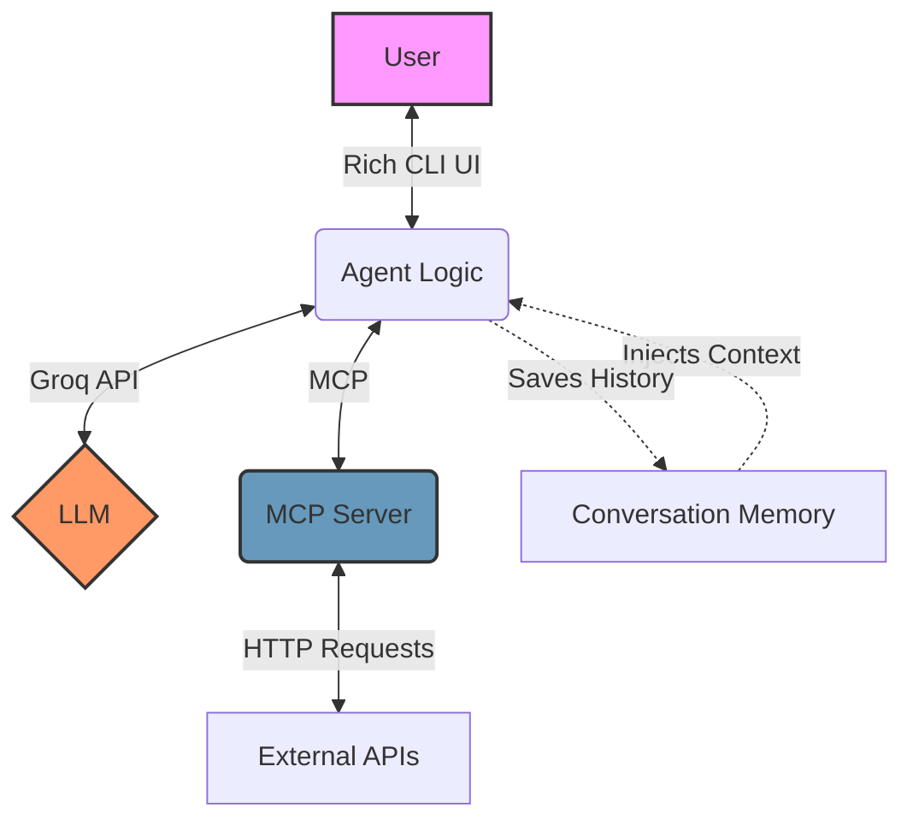

# Weekend Wizard

Weekend Wizard is a cheerful, AI-powered CLI agent designed to help you plan your weekend. Built using a **ReAct** (Reasoning and Acting) loop, it interacts with various external APIs through the **Model Context Protocol (MCP)** to fetch real-time data like weather, book recommendations, jokes, trivia, and dog photos.

## 🏗️ Workflow Architecture

The architecture separates the "Brain" of the agent from the "Tools" it uses, communicating over MCP via standard input/output (stdio).



### Key Components

1. **The Brain (`agent_fun.py`)**: 
   - Uses the ReAct pattern to think step-by-step.
   - Connects to the **Groq API** to power the LLM (`llama-3.3-70b-versatile`).
   - Parses the LLM's JSON output to either call a tool or provide a final answer to the user.
   - Features a one-shot reflection step where a second LLM prompt verifies the final answer for formatting or factual errors before displaying it.

2. **The Tools (`server_fun.py`)**:
   - An MCP server built with `FastMCP`.
   - Exposes free external APIs as modular tools (`get_weather`, `book_recs`, `random_joke`, `random_dog`, `trivia`).
   - The LLM receives the schema of these tools dynamically at startup.

3. **Conversation Memory (`memory.py`)**:
   - Persists chat history and user context to a local `memory.json` file.
   - Tracks session counts and extracts discussion topics (e.g., "books", "dogs") using keyword matching.
   - Injects this summary back into the LLM's system prompt for a personalized experience.

4. **Automated Evaluations (`run_evals.py`)**:
   - A benchmark script that tests the agent against 10 specific user queries without human intervention.
   - Computes metrics like **Tool Selection Accuracy** (TSA) and **Schema Compliance Rate** (SCR).
   - Uses an LLM-as-a-judge to grade the quality of the final textual responses.

## 🚀 Setup & Execution

### Prerequisites
- Python 3.10+
- A [Groq API Key](https://console.groq.com/keys)

### Installation

1. Create a virtual environment and install the dependencies (make sure `mcp`, `groq`, and `rich` are installed).
2. Set your Groq API key in your environment variables or in a `.env` file:
   ```bash
   # Windows (PowerShell)
   $env:GROQ_API_KEY="your-api-key-here"
   ```

### Running the Agent

To start the Weekend Wizard CLI:
```bash
python agent_fun.py
```
*Note: Type `help` in the CLI to see available commands like `clear memory`.*

### Running Evaluations

To run the automated test suite and generate the `eval_results_report.json` benchmark:
```bash
python run_evals.py
```
